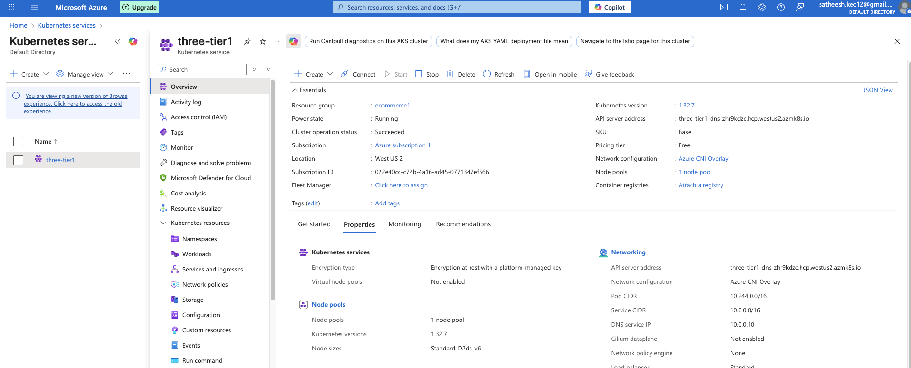
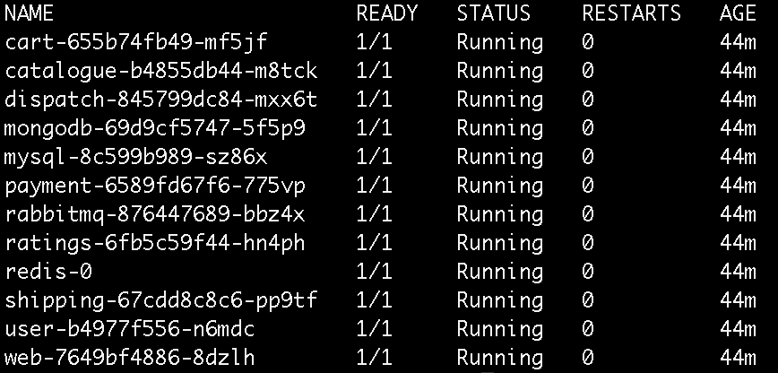
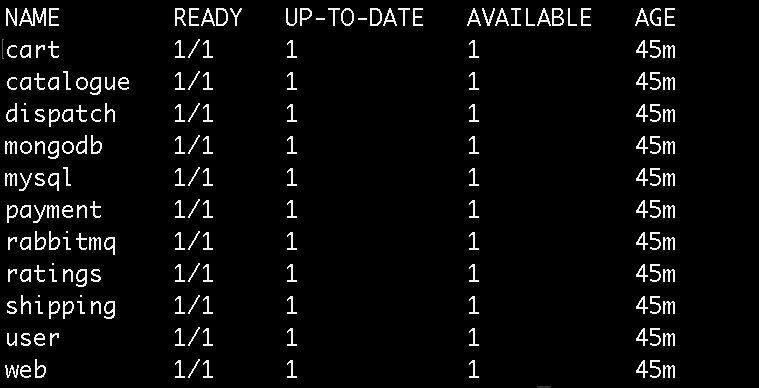
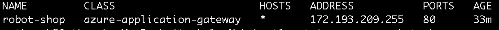

# Azure AKS Deployment using Helm and Ingress Controller 🚀

This project demonstrates how to deploy a microservices-based application on **Azure Kubernetes Service (AKS)** using **Helm charts**.  
It includes setting up an **Ingress Controller** integrated with **Azure Application Gateway** to securely expose the application to the internet via an external IP address.

---

## 🏗️ Project Overview

This deployment showcases a **cloud-native DevOps workflow** on Microsoft Azure.  
The project includes:
- AKS cluster creation and configuration
- Application deployment using Helm
- Ingress setup with Azure Application Gateway
- Secure external access through ingress routing

---

## 📸 Screenshots

| Description | Screenshot |
|--------------|-------------|
| **AKS Cluster Overview** |  |
| **Pods Running Status** |  |
| **Deployment Status** |  |
| **Ingress External IP** |  |
| **Application Running** |  |

> All screenshots are available under the `/screenshots` directory.

## 🧩 Architecture Summary

**Key Components:**
- **Azure Kubernetes Service (AKS):** Managed Kubernetes cluster to host workloads.
- **Helm:** Package manager for Kubernetes to simplify deployment.
- **Ingress Controller:** Configured to use the `azure-application-gateway` ingress class.
- **Azure Application Gateway:** Provides load balancing and external access to the cluster.

**Workflow:**
1. The application is packaged using Helm and deployed to the AKS cluster.
2. Kubernetes manages deployments, pods, and services.
3. The ingress controller routes incoming traffic through Azure Application Gateway.
4. The application becomes accessible externally through an assigned IP address.

---

## ⚙️ Implementation Steps

### 1. Create AKS Cluster
```bash
az aks create -g <resource-group> -n <aks-cluster-name> --node-count 3 --enable-addons monitoring --generate-ssh-keys
```
### 2. Connect to Cluster
``` bash
az aks get-credentials -g <resource-group> -n <aks-cluster-name>
```
### 3.Install Helm and Add Chart Repository
``` bash
helm repo add <repo-name> <repo-url>
helm repo update
```
### 4.Clone repository
``` bash
https://github.com/satheesh-kamadani/azure-aks-helm-ingress-deployment.git
cd azure-aks-helm-ingress-deployment/AKS/
```
### 5.Deploy Application using Helm
``` bash
helm install <release-name> <repo-name>/<chart-name>
```
### 6.Configure Ingress Controller
``` bash
 ingressClassName: azure-application-gateway
```
### 7.Verified external IP assignment:
``` bash
kubectl get ingress
```
### 8.Access the Application
``` bash
http://<external-ip>
```


